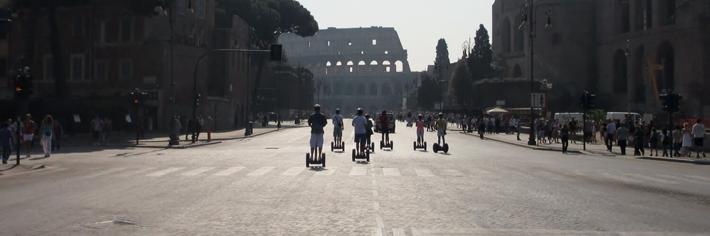

# Brave Location Software

Brave Location, through founder [John Pollard](https://bravelocation.com/cv), have been building Internet-based applications for over 20 years.

John is an experienced ex-Microsoft developer, 
    and has a wide range of experience in many different technical areas.

Our main areas of expertise are in:
 - Mobile development and design
    - iOS native
    - Android native
    - Flutter
    - A little Xamarin
    - Hybrid development 
 - Voice assistants
 - Enterprise-scale websites.

Brave Location is based is just south of the wall in Northumberland, UK.
